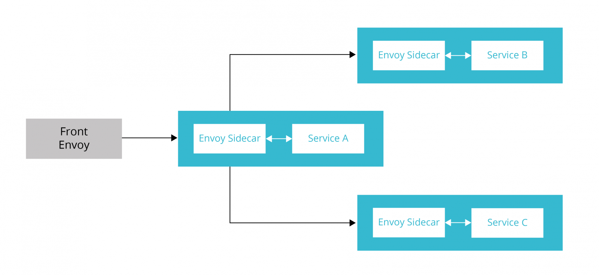
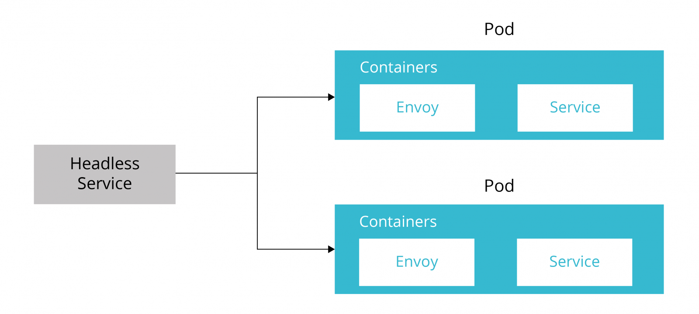

# Авито
Highload course project

## Содержание
* [1 Тема и целевая аудитория](#1)
* [2. Расчет нагрузки](#2)
* [3. Глобальная балансировка нагрузки](#3)
* [4. Локальная балансировка нагрузки](#3)


## 1. Тема и целевая аудитория <a name="1"></a>
Авито - сервис для размещения объявлений о товарах, недвижимости, вакансиях, с возможносью удобного и быстрого поиска объявлений, чата продавца и покупателя. Ориентирован на российский рынок.

### Аналоги
- Юла ( Россия )
- OLX ( Казахстан )
- eBay ( Мир )

### MVP
- Размещение объявлений
- Поиск объявлений
- Чат продавца и покупателя
- Просмотр объявления

### Целевая аудитория
MAU 44.7 млн человек, DAU 14.7 млн человек ([источник](https://www.avito.ru/b2b-hub/resources/files/%D0%9C%D0%B5%D0%B4%D0%B8%D0%B0%D0%BA%D0%B8%D1%82.pdf))

Распределение трафика по странам за август 2023 года ([источник](https://www.similarweb.com/ru/website/avito.ru/#traffic)):

| Страна     | Доля пользователей, % |
|------------|-----------------------|
| Россия     | 96.61                 |
| Украина    | 0.79                  |
| Казахстан  | 0.36                  |
| Беларусь   | 0.30                  |
| Нидерланды | 0.29                  |
| Другие     | 1.62                  |

## 2. Расчет нагрузки <a name="2"></a>
### Продуктовые метрики
| Метрика             | Значение |
|---------------------|----------|
| Месячная аудитория  | 44.7     |
| Дневная аудитория   | 14.7     |

#### Средний размер хранилища пользователя
У пользователя может быть аватар ≈ 1 Мб.
Сейчас на сайте размещено 176 750 952 объявлений ([источник](https://www.avito.ru/company)).
Так как сервис ориентирован на Россию, то каждый символ занимает 2 байта. 

У каждого объявления есть:
- Название ( ~20 символов, 40 байт)
- Описание ( ~1000 символов, 2000 байт)
- Фото ( ~5 фото по 1 Мб, 5 Мб )
- Чаты продавца и покупателей ( ~5 чатов по 500 символов ( по 5 сообщений ), 5000 байт)

То есть для одного объявления необходимо 5,7 Мб ≈ 6 Мб.

Кол-во объявлений / MAU ≈ 4 объявления на 1 пользователя.

Тогда средний размер хранилища пользователя = 1 + 6*4 = 25 Мб.

#### Среднее количество действий пользователя по типам в день 
Количество отправленных сообщений в минуту 40 000 ( в день 57 600 000 ) ([источник](https://inclient.ru/avito-stats/#soobsenia-avito)).  
Среднее количество страниц за визит 10.93 ([источник](https://www.similarweb.com/ru/website/avito.ru/#overview)).
Для дальнейших расчетов примем что 3 стр на поиск и 8 на просмотр объявлений.

| Действие                          | Среднее кол-во в день на пользователя |
|-----------------------------------|---------------------------------------|
| Размещение объявления             | 0.13                                  |
| Поиск и просмотр объявлений       | 10.93                                 |
| Количество отправленных сообщений | 3.9                                   |

### Технические метрики
#### Размер хранения в разбивке по типам данных
- Текст: 44.7 млн чел * 4 объявления * 7 Кб = 1.2 Тб.
- Изображения: 44.7 млн чел * (4 объявления * 5 Мбайт + 1 аватар * 1 Мб = 895.2 Тб.

| Тип данных  | Размер, Тб |
|-------------|------------|
| Текст       | 1.2        |
| Изображения | 895.2      |

#### Сетевой трафик
Пиковое увеличение трафика примем в 2 раза
- Пиковое потребление в теченнии суток : 2 * 14.7 млн чел  * 11 стр * 6 Мбайт / 86400 (сек в сут) = 21.9 Гбайт/сек = 175.2 Гбит/сек.
##### Суммарный суточный трафик
- текст: 14.7 млн чел * 11 стр * 7 Kбайт = 1079.5 Гбайт = 1.05 Тбайт.
- изображения: 14.7 млн чел * 11 стр * 5 Мбайт = 771.0 Тбайт.

| Техническая метрика                     | Значение       |
|-----------------------------------------|----------------|
| Пиковое потребление в течении суток     | 175.2 Гбит/сек |
| Суммарный суточный трафик - текст       | 1.05 Тб        |
| Суммарный суточный трафик - изображения | 771.0 Тб       |

#### RPS в разбивке по типам запросов. 
##### Размещение объявлений:
В день 400000 новых объявлений ([источник](https://www.avito.ru/company)).

400000 / 86400 сек ≈ 5 RPS
##### Поиск объявлений:
Ранее указывали что пользователь посещает 3 стр поиска.

14.7 млн  * 3 / 86400 сек ≈ 510 RPS
##### Отправка сообщений:
400000  * 5 чатов * 5 сообщ / 86400 сек ≈ 115 RPS
##### Просмотр объявлений:
Ранее указывали что пользователь посещает 8 стр объявлений.
  
14.7 млн * 8 просмотров / 86400 сек ≈ 1361 RPS

| Запрос               | RPS  |
|----------------------|------|
| Размещение объялений | 5    |
| Поиск объявлений     | 510  |
| Отправка сообщений   | 115  |
| Просмотр объявлений  | 1361 | 

## 3. Глобальная балансировка нагрузки <a name="3"></a>

### Расположение датацентов

Так как 96.61 % трафика - Россия, то все сервера разумно расположить в России. 

Учитывая [плотность населения России](https://ru.wikipedia.org/wiki/%D0%9F%D0%BB%D0%BE%D1%82%D0%BD%D0%BE%D1%81%D1%82%D1%8C_%D0%BD%D0%B0%D1%81%D0%B5%D0%BB%D0%B5%D0%BD%D0%B8%D1%8F_%D1%81%D1%83%D0%B1%D1%8A%D0%B5%D0%BA%D1%82%D0%BE%D0%B2_%D0%A0%D0%BE%D1%81%D1%81%D0%B8%D0%B9%D1%81%D0%BA%D0%BE%D0%B9_%D0%A4%D0%B5%D0%B4%D0%B5%D1%80%D0%B0%D1%86%D0%B8%D0%B8)
цоды можно арендовать в следующих городах:
* Москва 
* Санкт-Петербург 
* Екатеринбург
* Красноярск

### Глобальная балансировка

Для того чтобы пользователя направлять на ближайший цод можно использовать GeoDNS сервера, которые возвращают адреса ближайших к пользователю цодов.
Затем с балансировка производится помощью BGP Anycast.

## 4. Локальная балансировка<a name="4"></a>

### Балансировка для входящих и межсервисных запросов
Сначала запросы попадают на L4 балансировщики ( Virtual server via IP tunneling ), которые решают на какой хост отравить запрос, инкапсулируя IP пакет

Далее запрос попадает на один из "фронтов", на котором живет nginx для отдачи статики, терминирования SSL и проксирования к API

Все сервисы бэкенда живут в k8s, поэтому у каждого фронта помимо nginx стоит envoy, который настроен на походы в сервисы k8s

В каждом поде рядом с приложением стоит envoy, через который так же можно ходить в другие сервисы, таким образом получается service mesh, постороенная на envoy

Конфигурация сервисов с sidecar proxy


Конфигурация подов


Когда необходимо обеспечить поход например из front_envoy в service_a, то в манифесте указывается например 

```
name: "service_a"
connect_timeout: "0.25s"
type: "strict_dns"
lb_policy: "ROUND_ROBIN"
hosts:
-
socket_address:
address: "service_a_envoy"
port_value: 8786
```

Аналогично если нам нужно сходить из service_a в service_b или service_c

#### Схема отказоустойчивости

- резервирование фронтов, в случае резкого роста - ввод в нагрузку
- keepalived ( фронты, балансировщки ), с выводом из нагрузки упавших 
- liveness probe ( k8s )
- резервирование нод в k8s с возможностью скейлинга

#### Терминация SSL
Терминация SSL - на стороне nginx, далее весь трафик который идет на бэкенд - http

Чтобы оптимизировать, можно включить хранение кэша до 20Мб на 10 минут

```
ssl_session_cache shared:SSL:20m;
ssl_session_timeout 10m;
```

## Список литературы
[1]: [Презентация Авито](https://www.avito.ru/b2b-hub/resources/files/%D0%9C%D0%B5%D0%B4%D0%B8%D0%B0%D0%BA%D0%B8%D1%82.pdf)

[2]: [Данные о трафке similarweb](https://www.similarweb.com/ru/website/avito.ru/#traffic)

[3]: [Информация об отправленных сообщениях](https://inclient.ru/avito-stats/#soobsenia-avito)

[4]: [Статистика Авито](https://www.avito.ru/company)
