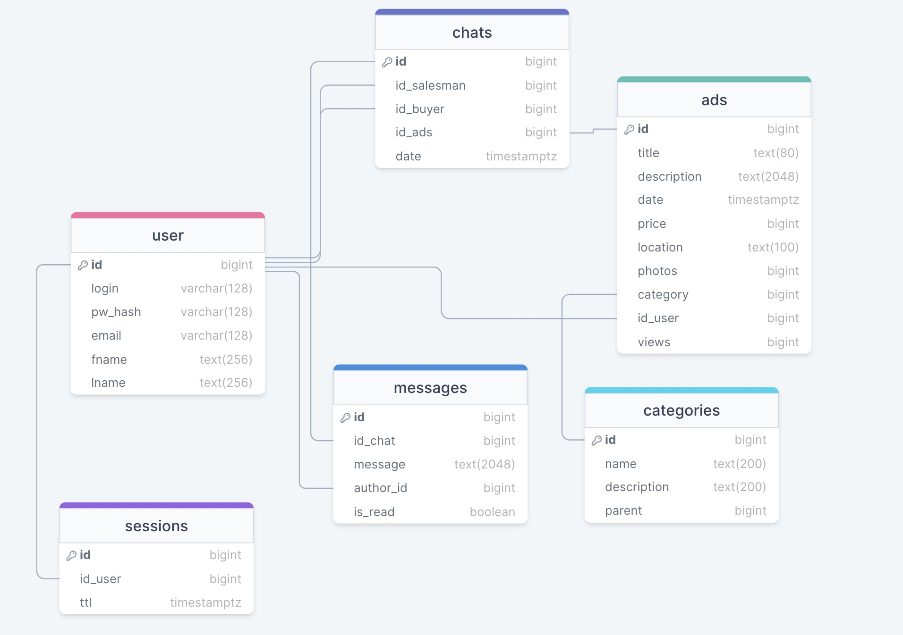

# Авито
Highload course project

## Содержание
* [1 Тема и целевая аудитория](#1)
* [2. Расчет нагрузки](#2)
* [3. Глобальная балансировка нагрузки](#3)
* [4. Локальная балансировка нагрузки](#4)
* [5. Логическая схема бд](#5)
* [6. Физическая схема бд](#6)
* [7. Оптимизации](#7)

## 1. Тема и целевая аудитория <a name="1"></a>
Авито - сервис для размещения объявлений о товарах, недвижимости, вакансиях, с возможносью удобного и быстрого поиска объявлений, чата продавца и покупателя. Ориентирован на российский рынок.

### Аналоги
- Юла ( Россия )
- OLX ( Казахстан )
- eBay ( Мир )

### MVP
- Размещение объявлений
- Поиск объявлений
- Чат продавца и покупателя
- Просмотр объявления

### Целевая аудитория
MAU 44.7 млн человек, DAU 14.7 млн человек ([источник](https://www.avito.ru/b2b-hub/resources/files/%D0%9C%D0%B5%D0%B4%D0%B8%D0%B0%D0%BA%D0%B8%D1%82.pdf))

Распределение трафика по странам за август 2023 года ([источник](https://www.similarweb.com/ru/website/avito.ru/#traffic)):

| Страна     | Доля пользователей, % |
|------------|-----------------------|
| Россия     | 96.61                 |
| Украина    | 0.79                  |
| Казахстан  | 0.36                  |
| Беларусь   | 0.30                  |
| Нидерланды | 0.29                  |
| Другие     | 1.62                  |

## 2. Расчет нагрузки <a name="2"></a>
### Продуктовые метрики
| Метрика             | Значение |
|---------------------|----------|
| Месячная аудитория  | 44.7     |
| Дневная аудитория   | 14.7     |

#### Средний размер хранилища пользователя
У пользователя может быть аватар ≈ 1 Мб.
Сейчас на сайте размещено 176 750 952 объявлений ([источник](https://www.avito.ru/company)).
Так как сервис ориентирован на Россию, то каждый символ занимает 2 байта. 

У каждого объявления есть:
- Название ( ~20 символов, 40 байт)
- Описание ( ~1000 символов, 2000 байт)
- Фото ( ~5 фото по 1 Мб, 5 Мб )
- Чаты продавца и покупателей ( ~5 чатов по 500 символов ( по 5 сообщений ), 5000 байт)

То есть для одного объявления необходимо 5,7 Мб ≈ 6 Мб.

Кол-во объявлений / MAU ≈ 4 объявления на 1 пользователя.

Тогда средний размер хранилища пользователя = 1 + 6*4 = 25 Мб.

#### Среднее количество действий пользователя по типам в день 
Количество отправленных сообщений в минуту 40 000 ( в день 57 600 000 ) ([источник](https://inclient.ru/avito-stats/#soobsenia-avito)).  
Среднее количество страниц за визит 10.93 ([источник](https://www.similarweb.com/ru/website/avito.ru/#overview)).
Для дальнейших расчетов примем что 3 стр на поиск и 8 на просмотр объявлений.

| Действие                          | Среднее кол-во в день на пользователя |
|-----------------------------------|---------------------------------------|
| Размещение объявления             | 0.13                                  |
| Поиск и просмотр объявлений       | 10.93                                 |
| Количество отправленных сообщений | 3.9                                   |

### Технические метрики
#### Размер хранения в разбивке по типам данных
- Текст: 44.7 млн чел * 4 объявления * 7 Кб = 1.2 Тб.
- Изображения: 44.7 млн чел * (4 объявления * 5 Мбайт + 1 аватар * 1 Мб = 895.2 Тб.

| Тип данных  | Размер, Тб |
|-------------|------------|
| Текст       | 1.2        |
| Изображения | 895.2      |

#### Сетевой трафик
Пиковое увеличение трафика примем в 2 раза
- Пиковое потребление в теченнии суток : 2 * 14.7 млн чел  * 11 стр * 6 Мбайт / 86400 (сек в сут) = 21.9 Гбайт/сек = 175.2 Гбит/сек.
##### Суммарный суточный трафик
- текст: 14.7 млн чел * 11 стр * 7 Kбайт = 1079.5 Гбайт = 1.05 Тбайт.
- изображения: 14.7 млн чел * 11 стр * 5 Мбайт = 771.0 Тбайт.

| Техническая метрика                     | Значение       |
|-----------------------------------------|----------------|
| Пиковое потребление в течении суток     | 175.2 Гбит/сек |
| Суммарный суточный трафик - текст       | 1.05 Тб        |
| Суммарный суточный трафик - изображения | 771.0 Тб       |

#### RPS в разбивке по типам запросов. 
##### Размещение объявлений:
В день 400000 новых объявлений ([источник](https://www.avito.ru/company)).

400000 / 86400 сек ≈ 5 RPS
##### Поиск объявлений:
Ранее указывали что пользователь посещает 3 стр поиска.

14.7 млн  * 3 / 86400 сек ≈ 510 RPS
##### Отправка сообщений:
400000  * 5 чатов * 5 сообщ / 86400 сек ≈ 115 RPS
##### Просмотр объявлений:
Ранее указывали что пользователь посещает 8 стр объявлений.
  
14.7 млн * 8 просмотров / 86400 сек ≈ 1361 RPS

| Запрос               | RPS  |
|----------------------|------|
| Размещение объялений | 5    |
| Поиск объявлений     | 510  |
| Отправка сообщений   | 115  |
| Просмотр объявлений  | 1361 | 

## 3. Глобальная балансировка нагрузки <a name="3"></a>

### Расположение датацентов

Так как 96.61 % трафика - Россия, то все сервера разумно расположить в России. 

Учитывая [плотность населения России](https://ru.wikipedia.org/wiki/%D0%9F%D0%BB%D0%BE%D1%82%D0%BD%D0%BE%D1%81%D1%82%D1%8C_%D0%BD%D0%B0%D1%81%D0%B5%D0%BB%D0%B5%D0%BD%D0%B8%D1%8F_%D1%81%D1%83%D0%B1%D1%8A%D0%B5%D0%BA%D1%82%D0%BE%D0%B2_%D0%A0%D0%BE%D1%81%D1%81%D0%B8%D0%B9%D1%81%D0%BA%D0%BE%D0%B9_%D0%A4%D0%B5%D0%B4%D0%B5%D1%80%D0%B0%D1%86%D0%B8%D0%B8)
цоды можно арендовать в следующих городах:
* Москва 
* Санкт-Петербург 
* Екатеринбург
* Красноярск

### Глобальная балансировка

Для того чтобы пользователя направлять на ближайший цод можно использовать GeoDNS сервера, которые возвращают адреса ближайших к пользователю цодов.
Затем с балансировка производится помощью BGP Anycast.

## 4. Локальная балансировка<a name="4"></a>

### Балансировка для входящих и межсервисных запросов

Сначала запросы попадают на L4 балансировщики ( Virtual server via IP tunneling ), которые решают на какой хост отравить запрос, инкапсулируя IP пакет.

Далее запрос попадает на один из "фронтов". Все сервисы бэкенда живут в k8s, поэтому у каждого фронта стоит envoy, который настроен на походы в сервисы k8s и териминирование SSL.

В каждом поде рядом с приложением стоит envoy, через который так же можно ходить в другие сервисы, таким образом получается service mesh, постороенная на envoy.

Конфигурация сервисов с sidecar proxy


Конфигурация подов


Когда необходимо обеспечить поход например из front_envoy в service_a, то в манифесте указывается например 

```
name: "service_a"
connect_timeout: "0.25s"
type: "strict_dns"
lb_policy: "ROUND_ROBIN"
hosts:
-
socket_address:
address: "service_a_envoy"
port_value: 8786
```

Аналогично если нам нужно сходить из service_a в service_b или service_c

#### Схема отказоустойчивости

- резервирование фронтов, в случае резкого роста - ввод в нагрузку
- keepalived ( фронты, балансировщки ), с выводом из нагрузки упавших 
- liveness probe ( k8s )
- резервирование нод в k8s с возможностью скейлинга

#### Терминация SSL
Терминация SSL - на стороне envoy, далее весь трафик который идет на бэкенд по http или grpc, если же возникает необходимость то трафик между отдельными сервисами идет по защищенному соединению.

## 5. Логическая схема бд<a name="5"></a>


#### Размер данных
##### Приближенный расчет:

**Users:** id(bigint=8)(P_Key) + login(varchar(128)=128) + password(varchar(128)=128)) + email(varchar(128)=128) + fname(text(256) + lname(text(256) ~ 904 байт на строку & 200 млн строк ~ 168 Гбайт

**Sessions**: id(bigint=8)(P_Key) + id_user(varchar(32)=32) + ttl(timestamp with time zone=8) ~ 48 байт на строку & 44 млн строк ~ 1.9 Гбайт

**Chats:** id(bigint=8)(P_Key) + id_salesman(bigint=8) + id_buyer(bigint=8) + id_ads(bigint=8) + date(timestamp with time zone=8) ~ 40 байт на строку & (100 * 44 млн) ~ 163 Гбайт

**Messages:** id(bigint=8)(P_Key) + id_chat(bigint=8) + message(text(1024)=2048) + author(bigint=8) + is_read(bool=1) ~ 1049 байт на строку & (100 * 5 * 44 млн) ~ 40 Тбайт 

**Ads:** id(bigint=8)(P_Key) + title(text(80) + description(text(2048) + date(timestamp with time zone=8) + price(bigint=8) + location(varchar(100) + photos(5*varchar(100)=500) + category(bigint=8) + id_user(bigint=8) + views(bigint=8) ~ 1712 байт на строку & (44 млн * 3 (месяца) * 5) ~ 1.6 Тбайт

title и description индексируются в поисковом движке (sphinx / elacticsearch)

location - точка в которой расположено объявление, включает в себя как координаты, так и описание населенного пункта, к которому привязана точка

**Categories:** id(bigint=8)(P_Key) + name(text(200) + description( 200) + parent(bigint=8) ~ 216 байт на строку & 10000 строк ~ 3.8 Гб

## 6. Физическая схема бд<a name="6"></a>
#### Индексы
**User:** b-tree(id)(P_KEY) hash(login)

**Sessions:** b-tree(id)(P_KEY), hash(id_user)

**Chats:** b-tree(id)(P_KEY), hash(id_buyer), hash(id_salesman)

**Messages:** b-tree(id)(P_KEY), hash(id_chat)

**Ads:** b-tree(id)(P_KEY), hash(id_user), gin(location), b-tree(date), b-tree(price), b-tree(location), hash(category), b-tree(views)

title + description индексируются в поисковом движке (sphinx)

**Categories:** b-tree(id)(P_KEY)


#### Денормализация
- Фотографии объявления в субд хранятся в виде массива из ссылок на файлы в s3

#### Выбор субд 

- Users - Postgresql
- Categories - Postgresql
- Messages - Postgresql
- Chats - Tarantool
- Sessions - Redis
- Views - Redis
- Ads - Postgresql + sphinx

#### Клиентские библиотеки
Основной язык бэкенда - Go, поэтому рассмотрим коннекторы для него

- Postgres - pgx (лучший по бенчмаркам и позволяет настраивать кол-во коннектов к бд)
- Tarantool - [официальный драйвер от разработчиков](https://github.com/tarantool/go-tarantool)
- Redis - [официальный драйвер от разработчиков](https://github.com/redis/go-redis)(лучший по бенчмаркам и лучший по качеству поддержки)

#### Балансировка запросов
##### Шардирование
Шардирование имеет смысл делать для таблиц "Объявления" и "Сообщения" исходя из их размеров.

Таблица Объявления будут разделены на категории: Товары, Недвижимость, Работа, Другое.
Группы этих объявлений не пересекаются, поэтому можно шардировать объявления по этим группам. 

Таблицу Сообщения можно шардировать по chat id, чтобы при открытии чата и получении сообщений запрос шел только в один шард.

##### Репликация
Каждая база данных будет иметь 3 реплики. В master - запись, slave - чтение. Это позволит надежно хранить данные и иметь достаточную скорость доступа к данным.

##### Производительность
Для увеличения производительности работы бд необходимо работать с бд в ограниченное число коннектов от каждого из бэкендов.
Для сложной логики держания коннектов, вычисления шарда, в который нужно пойти, можно писать свою реализацию прокси, которая будет локально стоять с каждым инстансом бекенда. 

## 7. Оптимизации<a name="7"></a>
#### Использование ресурсов системы
Так как приложение планируется писать на Go, то за использование всех ядер отвечает планировщик Go, который сам определяет на каком системном треде выполнить функцию, в какой момент необходимо сделать переключение. 

#### Поисковые алгоритмы
1. Инвертированное индексирование. использование структуры данных инвертированного индекса для сопоставления терминов с документами, которые их содержат. Это позволяет быстро находить нужные документы на основе поисковых запросов.
2. Ранжирование и оценка. алгоритмы ранжирования для определения релевантности документов данному поисковому запросу. Он использует такие факторы, как частота терминов, длина документа и обратная частота документов, для расчета оценок и соответствующего ранжирования результатов поиска
3. Логическое сопоставление фраз. поддержка логических операторов (И, ИЛИ, НЕ) и сопоставление фраз, что позволяет пользователям создавать сложные поисковые запросы. Алгоритмы: логическая оценка запроса и оценка близости фраз, для определения релевантности документов
#### Кэширование
##### Поиск
Можно реализовать умную систему кэширования, на каждый запрос поиска по категории + локации + тексту, каждый инстанс бэкенда увеличивает соответствующую метрику в сервисе который управляет кэшами. В этом сервисе задается с какого количества запросов в минуту по данному условия поиска надо кэшировать и на сколько. С этой периодичностью сервис обновляет кэш на соответсвующий поисковый запрос.

Каждый бэкенд в отдельной горутине периодически получает поисковые условия, по которым надо идти в сервис кэша и обновляет их у себя.
Когда поступает поисковый запрос в клиентской библиотеке для поискового сервиса реализована логика, в зависимости от наличия такого условия для поиска в кэше реализуется логика походов.

Если какое-то условие поиска стало редким, то сервис кэша перестает отдавать клиентам это условие для поиска и через время равное 2 периодам проверки кэша перестает обновлять ответ на данное условие и окончательно его удаляет.

## Список литературы
[1]: [Презентация Авито](https://www.avito.ru/b2b-hub/resources/files/%D0%9C%D0%B5%D0%B4%D0%B8%D0%B0%D0%BA%D0%B8%D1%82.pdf)

[2]: [Данные о трафке similarweb](https://www.similarweb.com/ru/website/avito.ru/#traffic)

[3]: [Информация об отправленных сообщениях](https://inclient.ru/avito-stats/#soobsenia-avito)

[4]: [Статистика Авито](https://www.avito.ru/company)
